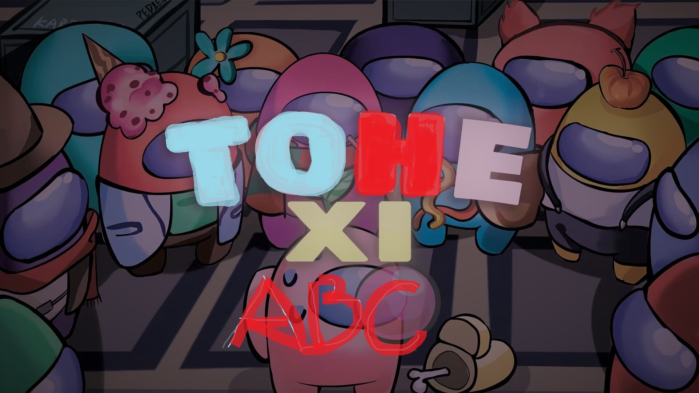

<h1 align="center">~ TownofHost Edited Xi ~</h1>

## 语言
[简体中文](https://github.com/AboringCat/TOHEX-ABC/blob/main/README.md)
[日本語](Comming Soon..)

 
 

  
> ### Regarding this mod
>
> This mod is not affiliated with Among Us or Innersloth LLC, and the content contained therein is not endorsed or otherwise sponsored by Innersloth LLC. Portions of the materials contained herein are property of Innersloth LLC. © Innersloth LLC.
>

-------------------------------------------------------------

Regardin WebSite
  

  
 
  
### The Latest Version：
support AmongUs v2023.7.11 and above

The Latest Version: v2.0.0

**TOHE was stopping support at v2.3.6.** 
**But!TOHEX-ABC continuing TOHE!**

## Source of some Role ideas

[Town Of Host](https://github.com/tukasa0001/TownOfHost) 
[Town Of Host Edited](https://github.com/KARPED1EM/TownOfHostEdited) 
[Town Of Host_Y](https://github.com/Yumenopai/TownOfHost_Y) 
[Town Of Host : The Other Roles](https://github.com/music-discussion/TownOfHost-TheOtherRoles) 
[Super New Roles](https://github.com/ykundesu/SuperNewRoles) 
[Town Of Host-ReEdited](https://github.com/Loonie-Toons/TownOfHost-ReEdited) 
[Town Of Us](https://github.com/Loonie-Toons/TownOfHost-ReEdited) 
[Town-Of-Us-R](https://github.com/eDonnes124/Town-Of-Us-R) 
[Foolers Mod](https://github.com/MengTube/Foolers-Mod) 
[Nebula on the Ship](https://github.com/Dolly1016/Nebula) 
[The Other Roles](https://github.com/TheOtherRolesAU/TheOtherRoles) 
[The Other Roles: GM Edition](https://github.com/yukinogatari/TheOtherRoles-GM) 
[The Other Roles: GM Haoming Edition](https://github.com/haoming37/TheOtherRoles-GM-Haoming) 
[QQ Channel](https://pd.qq.com/s/1la0nbwal)'s**Players** 
**Thank you to all mods for their excellent ideas, which have created us** 
**Thank you even more to the players who have supported us. It is you who have given us the motivation to continue!**

# Special Thanks

>
>### :star: [Town Of Host](https://github.com/tukasa0001/TownOfHost) :
>
> - Developer：[tukasa0001](https://github.com/tukasa0001)
> - Our mod is based on Town Of Host
>
>### :star: [Town Of Host Edited](https://github.com/KARPED1EM/TownOfHostEdited) :
> 
> - Developer：[KARPED1EM](https://github.com/KARPED1EM)
> - Our mod is forked from Town Of Host Edited
> - **Thanks TOHE's developer Karpe's Nearly 100000 lines of code have established an excellent foundation for our mod**
>
>### :star: [Town Of Host_Y](https://github.com/Yumenopai/TownOfHost_Y) :
> 
> - Developer：[Yumenopai](https://github.com/Yumenopai)
> - Many role ideas
> - Provided roles: AntiAdminer, CursedWolf, Workaholic, Greedier, DarkHide
> - Reference: Modify game announcement(After v2023.7.11)
>### :star: [Town Of Host : The Other Roles](https://github.com/music-discussion/TownOfHost-TheOtherRoles) :
>
> - Developer：[Music Discussion](https://github.com/music-discussion)
> - Many role ideas
> - Reference: Exile Confirm
> - Reference: Split RPC Pack
> - Provided roles: Copy-cat(Killer)
>
>### :star: [Super New Roles](https://github.com/ykundesu/SuperNewRoles) :
> 
> - Developer：[ykundesu](https://github.com/ykundesu)
> - Reference: Credentials menu(Before v2023.7.11)
> - Reference: Switch Horse Mode
> - Reference: Search Mod Game
> - Reference: Custom Button(Before v2023.7.11)
>
>### :star: [Town Of Plus](https://github.com/tugaru1975/TownOfPlus) :
> 
> - Developer：[tugaru1975](https://github.com/tugaru1975)
> - Reference: Zoom
>
>### :star: [Revolutionary Host Roles](https://github.com/sansaaaaai/Revolutionary-host-roles) :
> 
> - Developer：[sansaaaaai](https://github.com/sansaaaaai)
> - Reference: Modify settings menu 
>
>### :star: [Town Of Host-ReEdited](https://github.com/Loonie-Toons/TownOfHost-ReEdited) :
> 
> - Developer：[Loonie-Toons](https://github.com/Loonie-Toons)
> - Many role ideas
> - Provided roles: Medic, Disperser, Researcher
>  

# ***Credits***

>> ***Developers：*** 
>[A Boring Cat]()- **Main Developer** - 

